# 過渡期 ICN アーキテクチャ フローチャート

`設計メモ.txt` に記載の IP オーバーレイ ICN（IWP）設計を図示したもの。
Mermaid 対応ビューア（GitHub、VS Code 等）でレンダリングできる。

---

## 1. 全体構成

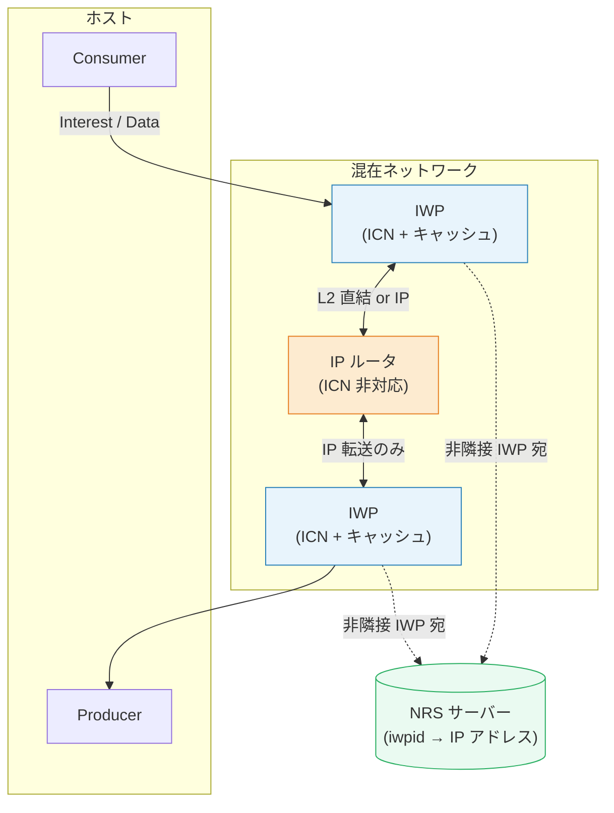

**要点:** 全ルータを IWP に置き換えられない過渡期のため、IP ルータを挟んでも
Interest / Data が到達できるよう IP 層でカプセル化する。

---

## 2. パケット構造

### 2.1 積層構成（L1 → L2 → IP → ICN）

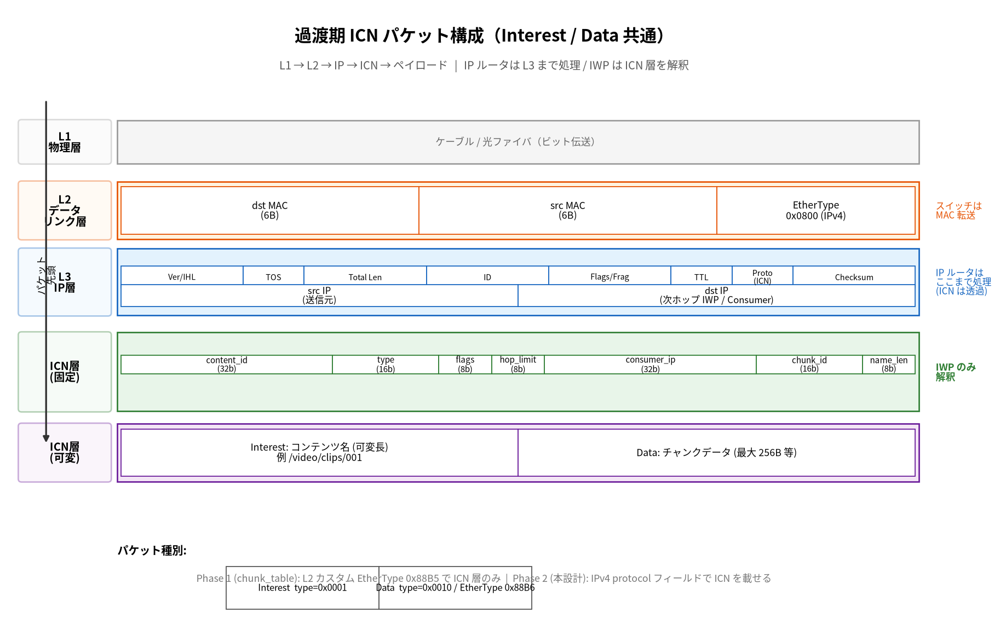

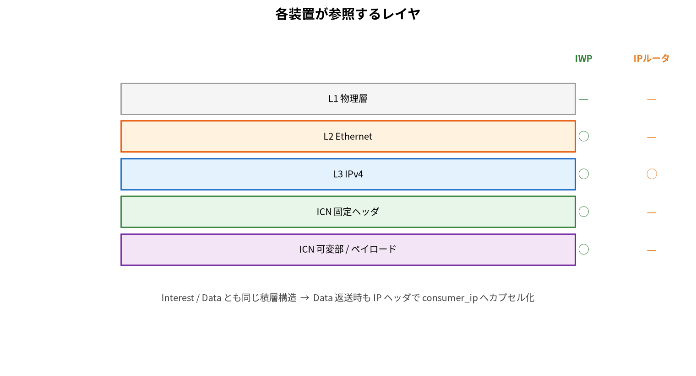

PNG 再生成: `python3 generate_packet_structure.py`

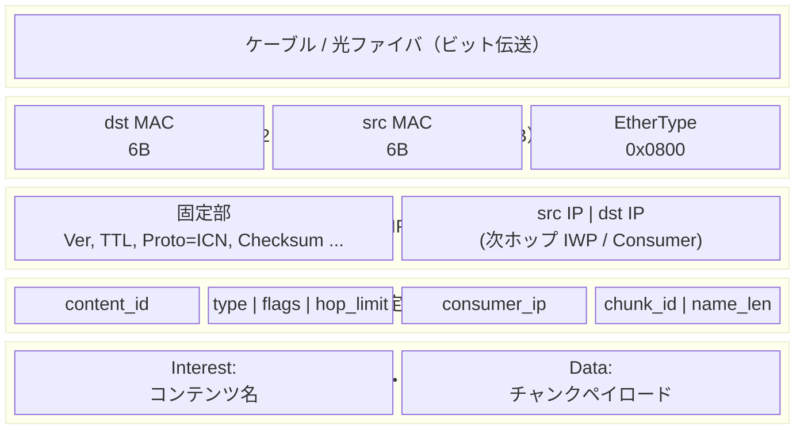

| レイヤ | 誰が処理するか | 設計メモでの役割 |
|--------|---------------|-----------------|
| **L1 物理** | 物理装置 | ビット伝送 |
| **L2 Ethernet** | L2 スイッチ / IWP | 隣接 IWP 間は NMT でポート直出力も可 |
| **L3 IPv4** | **IP ルータ + IWP** | IP ルータはここまで（ICN は透過転送） |
| **ICN 固定** | **IWP のみ** | PIT / LCST / ECST / FIB の制御情報 |
| **ICN 可変** | **IWP のみ** | コンテンツ名（Interest）または Data 本体 |

### 2.2 Interest と Data の違い（ICN 可変部）

| パケット | type | ICN 可変部 |
|---------|------|-----------|
| **Interest** | `0x0001` | コンテンツ名（FIB LPM / ECST 完全一致キー） |
| **Data** | `0x0010` | チャンクデータ（256B 等）+ chunk_id |

**共通:** `consumer_ip` は ICN 固定ヘッダに保持 → Data 返送時の IP カプセル化に使用（設計メモ L7）。

### 2.3 Phase 1 との差（参考）

| | Phase 1 (`chunk_table`) | Phase 2（本設計） |
|--|------------------------|-------------------|
| L2 | EtherType `0x88B5` で ICN 直載せ | EtherType `0x0800`（IPv4） |
| IP 層 | なし | **あり**（IP ルータ透過転送） |
| ICN 層 | 64bit 固定 | 128bit 固定 + 可変 Name |

---

## 3. IWP 内部テーブル

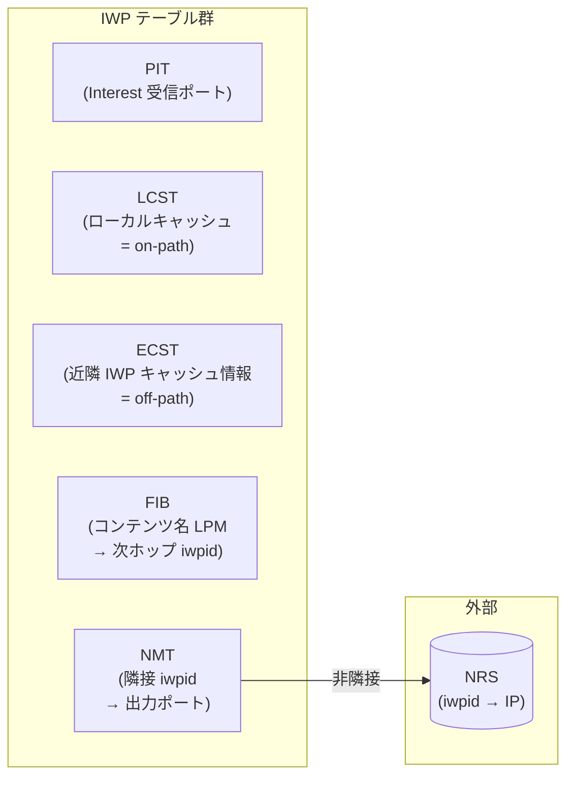

| テーブル | キー | 値 | 構築方法 |
|---------|------|-----|---------|
| **PIT** | コンテンツ名 | 受信ポート | Interest 受信時に記録 |
| **LCST** | コンテンツ名 | コンテンツデータ | Data 通過時、キャッシュ提案 flag=1 |
| **ECST** | コンテンツ名 | キャッシュ保有 iwpid | 近隣 IWP からの定期通知 |
| **FIB** | コンテンツ名プレフィックス | 次ホップ iwpid | 階層名 LPM（管理者設定） |
| **NMT** | 隣接 iwpid | 出力ポート | エコーパケットで 1 ホップ隣接を学習 |
| **NRS** | iwpid | IP アドレス | 外部サーバー（DNS 相当） |

---

## 4. Interest 処理フロー（メイン）

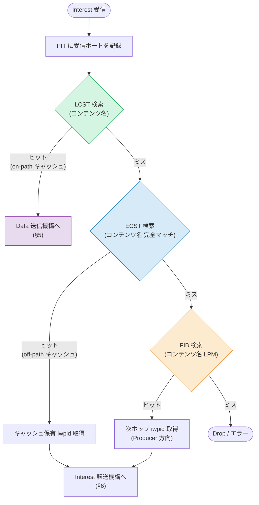

---

## 5. Data 送信・転送フロー

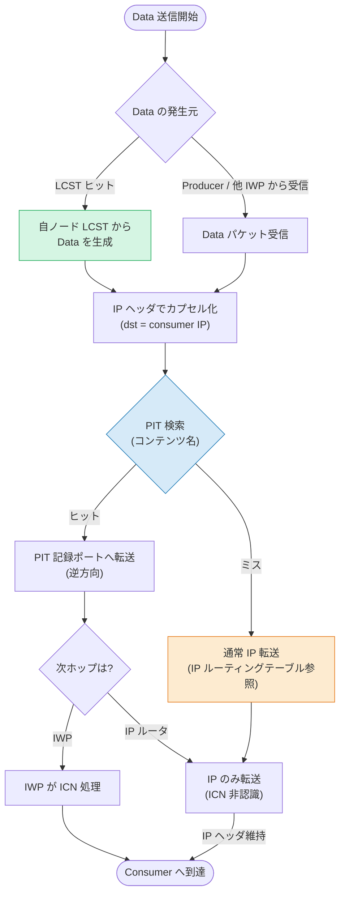

**過渡期の制約:** Data に consumer IP を指定するため、同一 Data を
複数 Consumer へ PIT マルチキャストできない（全 IWP 化後に解消）。

---

## 6. Interest 転送機構（NMT / NRS 分岐）

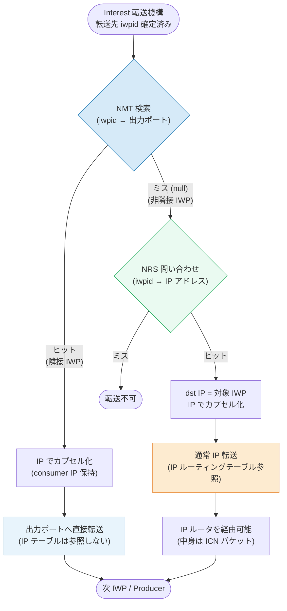

---

## 7. End-to-End シナリオ（off-path キャッシュ）

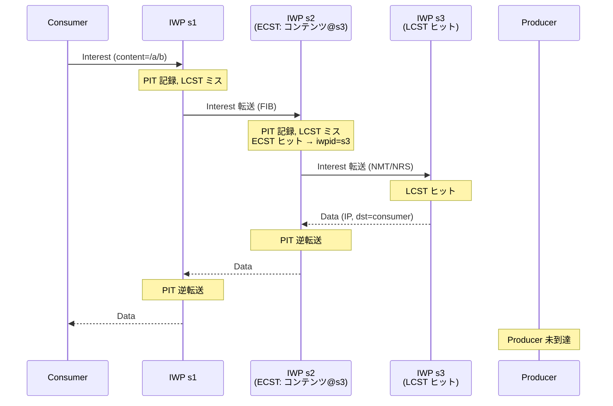

---

## 8. テーブル構築・更新フロー

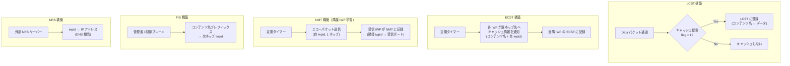

---

## 9. 移行ロードマップ

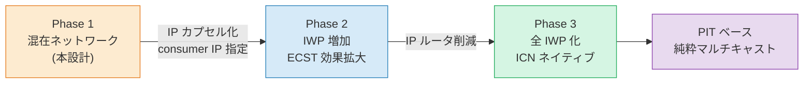

---

## 関連ファイル

| ファイル | 内容 |
|---------|------|
| `設計メモ.txt` | 設計の原文 |
| `generate_architecture_flowchart.py` | PNG 図の再生成スクリプト |
| `architecture_interest_flow.png` | Interest 処理フロー（PNG） |
| `architecture_interest_forward.png` | Interest 転送 NMT/NRS（PNG） |
| `architecture_packet_structure.png` | L1/L2/IP/ICN パケット構成図 |
| `architecture_packet_layers.png` | 各装置が参照するレイヤ |
| `generate_packet_structure.py` | パケット構成 PNG 再生成 |
| `chunk_table/` | Phase 1 実装（L2 ICN + on-path キャッシュ） |
| `mcd_cache/` | IP オーバーレイ試作 |
| `METHODOLOGY.md` | 性能評価手法 |
